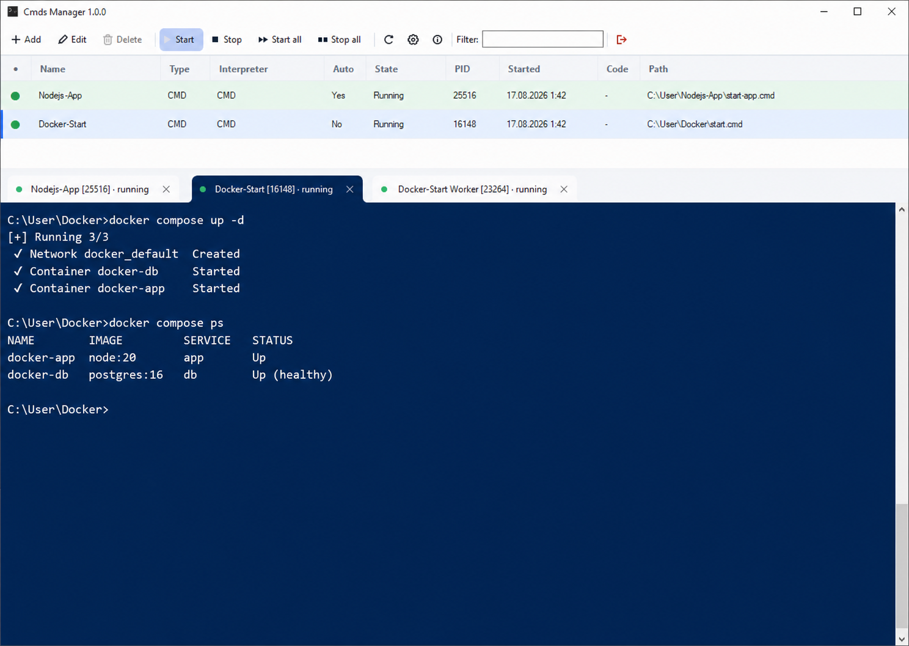

# Cmds Manager

Compact portable manager for CMD, BAT, PowerShell, and VBS scripts on Windows,
maintained by [iMiKED from 4PDA](https://4pda.to/forum/index.php?showuser=1017942).

[](https://github.com/iMiKED/cmds-manager/actions/workflows/build.yml)
[](https://github.com/iMiKED/cmds-manager/actions/workflows/codeql.yml)
[](https://github.com/iMiKED/cmds-manager/releases)
[](https://www.gnu.org/licenses/gpl-3.0.html)
[](https://buymeacoffee.com/danceworldtv)
[](https://paypal.me/imiked)
[](https://boosty.to/danceworldtv/donate)
[](https://finance.ozon.ru/apps/sbp/ozonbankpay/019a0a87-1f4a-7df8-97c7-ef32ebf9a0e3)



## Description

Cmds Manager is a lightweight Windows tray application for organizing, running,
monitoring, and stopping local automation scripts. It keeps a searchable script
catalog in a portable INI file and presents captured output in a modern tabbed
console workspace. The current source version is 1.1.0.

The application is built with C# and Windows Forms for .NET Framework 4.8. The
release contains one production executable and does not bundle PowerShell, .NET,
Chromium, Qt, Python, or another large runtime.

## Support the Project

If you like Cmds Manager or it saves you time, you can support the author:

- Russia transfers: [Ozon Bank / SBP](https://finance.ozon.ru/apps/sbp/ozonbankpay/019a0a87-1f4a-7df8-97c7-ef32ebf9a0e3)
- VISA: `4400430236422744`
- [Buy Me a Coffee](https://buymeacoffee.com/danceworldtv)
- [PayPal](https://paypal.me/imiked)
- [Boosty](https://boosty.to/danceworldtv/donate)
- USDT Ethereum (ERC20): `0xBd0593dDF1DFC7fD95bB6F4e6A5c73Da44048B40`
- USDT TON: `UQCr2Fp7t34QFuO4IesN3Lo3186a93Z1B7Wu76imr6APIXgk`
- USDT Tron (TRC20): `TE5A3GT84eJ9iT3mYYLv1KXJnMaiZFxNuA`

## Features

### Script management

- Add, edit, remove, enable, and disable script entries
- Start or stop one script, all selected scripts, or the complete managed set
- Open script files in an external editor without executing them accidentally
- Configure interpreter, arguments, working directory, window mode, output
  encoding, parallel instances, stop policy, and stop timeout per script
- Start selected scripts automatically when Cmds Manager starts
- Control auto-start order and per-script delay

### Process supervision

- Run CMD, BAT, PowerShell, and VBS scripts without elevation
- Support Windows PowerShell 5.1 and an optional PowerShell 7 installation
- Assign launched processes to a Windows Job Object
- Stop the complete managed process tree when a script, console tab, or Cmds
  Manager itself is closed
- Redirect supported child `start ... cmd` launches back into Cmds Manager as
  neighboring console tabs instead of separate console windows
- Display a persistent green running indicator and live PID/state information

### Console workspace

- Capture stdout and stderr in a dedicated tab for every managed launch
- Batch UI updates for responsive high-volume output
- Configure the displayed history buffer size for every console
- Decode UTF-8, Windows-1251, OEM Windows, UTF-16 LE, or mixed output in Auto mode
- Re-decode already captured bytes after changing a tab's encoding
- Search the active console with `Ctrl+F`; use `F3` and `Shift+F3` for the next
  or previous match
- Freeze and resume automatic scrolling with `Scroll Lock`
- Record each console to a dedicated UTF-8 file automatically or on demand;
  pause, resume, stop, and enforce a hard per-file size limit
- Configure the font, text color, background color, tab colors, and opacity
- Store Word Wrap separately for every script and its managed child tabs
- Copy selected text or save the selection/full console buffer to a file
- Close a tab and stop its process with the tab close button
- Detach a running tab into its own window without restarting the process
- Maximize the console workspace or show the active console full-screen
- Resize the console area and persist its height in the INI file

### Application experience

- Open or hide the main window with one click on the notification-area icon
- Register a configurable **Show App Hotkey** that globally shows and activates
  Cmds Manager while it is running
- Close the main window to the tray or exit explicitly
- Start Cmds Manager with Windows for the current user
- Save main-window position, size, maximized state, and console-pane height
- Recover the main window automatically if Windows leaves it at an invisible
  minimized sentinel position or a saved monitor is no longer available
- Choose System, Light, or Dark Fluent Compact themes
- Use English or Russian interface strings stored in the INI file
- View version, build time, author, license, website, and donation links in About

## Supported script types

| File type | Interpreter options | Captured console output |
| --- | --- | --- |
| `.cmd`, `.bat` | `cmd.exe` | Yes |
| `.ps1` | Windows PowerShell 5.1 or PowerShell 7 | Yes |
| `.vbs` | `cscript.exe` or `wscript.exe` | With `cscript.exe` |

`Auto` selects the interpreter from the file extension. PowerShell 7 is optional
and is only required by entries that explicitly select it.

## Requirements

### Running the application

- Windows 10 or Windows 11 x64
- .NET Framework 4.8
- Write access to the extracted portable directory
- PowerShell 7 only when selected for a script

Cmds Manager does not request administrator privileges. Processes requiring UAC
must be launched outside the managed process tree.

### Building from source

- Windows 10 or Windows 11 x64
- Visual Studio 2022 Build Tools or Visual Studio 2022 with MSBuild
- PowerShell 5.1 or later
- Git

The .NET Framework reference assemblies used during compilation are restored as
a development-only NuGet dependency. They are not included in the release.

## Installation

1. Download the latest Portable ZIP from
   [GitHub Releases](https://github.com/iMiKED/cmds-manager/releases).
2. Extract the complete archive to a permanent directory where your account can
   create and update files.
3. Run `CmdsManager.exe`.
4. Add scripts through the toolbar or edit `CmdsManager.ini` and choose
   **Reload INI**.

On first start, `CmdsManager.ini` is created next to the executable from the
included `CmdsManager.ini.example` template.

## Configuration

Cmds Manager keeps its portable configuration beside the executable. Relative
paths are resolved from this directory and Windows environment variables such as
`%SystemRoot%` are expanded.

| INI section | Purpose |
| --- | --- |
| `[Application]` | Theme, tray behavior, Show App Hotkey, auto-start, editor, logs, window geometry, console behavior and appearance |
| `[Defaults]` | Initial launch profile for newly added scripts |
| `[PowerShell]` | Optional path to `pwsh.exe` |
| `[Localization]` | Active language |
| `[Strings.en]`, `[Strings.ru]` | Editable interface strings |
| `[Script:<GUID>]` | One saved script and its complete launch profile |

The complete English and Russian user guide, version history, and reference for
every INI setting are available in [Readme.txt](Readme.txt).

## Logs and privacy

Application event logs are written to the `logs` directory beside the executable.
Dedicated console recordings are UTF-8 files under `logs\console`; they can be
started manually or for every new console with `ConsoleAutoRecord=true`, paused,
resumed, and stopped without affecting the process. `ConsoleLogMaxSizeMb` limits
each recording. `LogScriptOutput=true` separately copies captured stdout/stderr
into the application event log and can therefore duplicate output. Script output
can contain tokens, passwords, paths, or personal data, so logging should only be
enabled when required.

## Build and test

From a PowerShell prompt in the repository root:

```powershell
.\build.ps1
```

The script restores dependencies, builds Release x64, runs the standalone test
suite, and creates a portable archive under `artifacts`:

```text
artifacts/CmdsManager-portable-<version>-win-x64.zip
```

To compile and package without running tests:

```powershell
.\build.ps1 -SkipTests
```

For release validation, the expected tag can be supplied explicitly:

```powershell
.\build.ps1 -ExpectedVersion 1.1.0
```

The command fails when the tag and `AssemblyInformationalVersion` differ.

## Portable package contents

```text
CmdsManager.exe
CmdsManager.exe.config
CmdsManager.ini.example
Readme.txt
```

## Project layout

```text
src/CmdsManager/              Application source
tests/CmdsManager.Tests/      Standalone integration and UI contract tests
.github/workflows/            Build/release and CodeQL automation
docs/                         README image assets
assets/                       Application icon source
build.ps1                     Release build and packaging entry point
Readme.txt                    Portable bilingual user documentation
```


## Author

[iMiKED from 4PDA](https://4pda.to/forum/index.php?showuser=1017942)

## License

Cmds Manager is free software distributed under the
[GNU General Public License v3.0](https://www.gnu.org/licenses/gpl-3.0.html).
